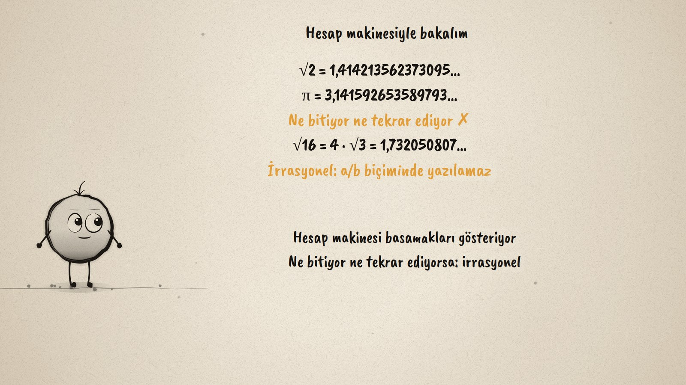
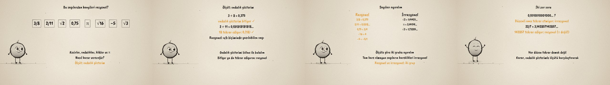

# Rasyonel mi? · Rational and Irrational Numbers

**▶ Tarayıcıda izleyin / Watch in the browser:** https://hakanatas.github.io/rasyonel-mi/ 
**⬇ MP4 + altyazılar / MP4 + subtitles:** [Releases](https://github.com/hakanatas/rasyonel-mi/releases) 
**✎ Kullanılan istem / The prompt behind it:** [PROMPT.md](PROMPT.md) 
**🎞 Bütün filmler / All films:** [Nokta'nın Filmleri](https://hakanatas.github.io/nokta-filmleri/?sinif=8)

> **TR —** 8. sınıf matematik "Sayılar ve Nicelikler" temasındaki MAT.8.1.3 öğrenme çıktısı için hazırlanmış, tamamen JavaScript ile çizilen 92 saniyelik mürekkep animasyonu. Kesirler, ondalık sayılar, kökler ve π: hangileri rasyonel? Ölçüt ondalık gösterim. Bölmeyle 3/8 = 0,375 (bitiyor) ve 2/11 = 0,1818… (18 tekrar ediyor) bulunuyor: bunlar a/b biçiminde yazılabilen rasyonel sayılar. Hesap makinesiyle √2 = 1,41421356… ve π = 3,14159265… görülüyor: basamaklar ne bitiyor ne tekrar ediyor, bu sayılar irrasyonel; √16 ise tam 4. Sayılar ölçüte göre iki gruba ayrılıyor. Son olarak iki zor soru yargılanıyor: 0,1010010001… düzenli ama tekrar etmiyor (irrasyonel); 22/7 = 3,142857… tekrar ediyor (rasyonel, π değil!). Altyazılar Türkçe, İngilizce ya da ikisi birlikte seçilebilir.

A 92-second ink animation for **8th-grade maths**. Nokta, the ink character from [The Learning Ink](https://github.com/hakanatas/the-learning-ink), is the guide again. The decimals are typed out digit by digit from a fixed left edge (`typed` in `scenes/scene1.js`), the way a division or a calculator produces them, so a repeating block and a never-repeating tail can be watched as they appear.

## Learning outcome

MEB, Türkiye Yüzyılı Maarif Modeli, Ortaokul Matematik, 8th grade, "Sayılar ve Nicelikler" theme:

**MAT.8.1.3. Sayıların rasyonel ya da irrasyonelliğini değerlendirebilme**
- a) Sayıların rasyonel ya da irrasyonel sayılar olup olmadığına ilişkin ondalık gösterimlerini ölçüt olarak belirler.
- b) Sayıların ondalık gösterimlerini bölme işlemi ya da hesap makinesi kullanarak elde eder.
- c) Elde ettiği ondalık gösterimi ölçütü ile karşılaştırır.
- ç) Karşılaştırmalarından hareketle bir sayının rasyonel olup olmadığına yönelik yargıda bulunur.

## Scenes

| # | Time | Scene | What happens | Outcome |
|---|---|---|---|---|
| 1 | 0–10 s | Sayılar | Eight number cards: which are rational? | a |
| 2 | 10–28 s | Ölçüt | 3/8 = 0,375 ends, 2/11 = 0,(18) repeats: rational. | a, b |
| 3 | 28–46 s | Hesap makinesi | √2 and π neither end nor repeat: irrational; √16 = 4. | b, c |
| 4 | 46–64 s | Ayır | The cards sorted into rational and irrational. | c, ç |
| 5 | 64–80 s | Zor sorular | 0,1010010001… is irrational; 22/7 is rational, not π. | ç |
| 6 | 80–92 s | Aklında kalsın | Ends or repeats: rational; neither: irrational. | a–ç |

## Running it

- **Preview:** double-click `index.html` (it works offline).
- **MP4:** run `npm install` once, then `npm run export -- --format=horizontal --captions=tr`.
- **Subtitles and narration:** `npm run srt` writes `out/captions_*.srt` and `narration_notes.txt`.
- **Editing:**
  - Caption text, timings and narration notes: `captions.js`
  - Everything on screen is drawn by `LI.world(t)` in `scenes/scene1.js` (the cards, the decimals, the groups, the words); the other scenes only set the camera.
  - Nokta's poses: `src/draw/film.js`; layout for 16:9 and 9:16: `src/draw/kd.js`

It uses the same engine as The Learning Ink: `renderFrame(t)` as a pure function of time, seeded randomness, and frame-by-frame export.

## Lisans · License

**TR —** Bu film ve kodu [Creative Commons Atıf-GayriTicari 4.0 Uluslararası (CC BY-NC 4.0)](https://creativecommons.org/licenses/by-nc/4.0/deed.tr) lisansıyla paylaşılır. Ticari olmayan her amaçla (derste, okulda, eğitim materyalinde) kopyalayabilir, paylaşabilir ve değiştirebilirsiniz; ancak **kaynak göstermek zorunludur**: eser sahibinin adı ve bu deponun bağlantısı belirtilmeden kullanılamaz. Ticari kullanım (satış, ücretli ürün ya da yayın) için izin alınmalıdır.

**EN —** This film and its code are licensed under [Creative Commons Attribution-NonCommercial 4.0 International (CC BY-NC 4.0)](https://creativecommons.org/licenses/by-nc/4.0/). You may copy, share and adapt them for non-commercial purposes, but **attribution is required**: they may not be used without crediting the author and linking to this repository. Commercial use requires permission.

Atıf örneği / Required credit: *“Rasyonel mi?”, Hakan Ataş, Nokta'nın Filmleri — https://github.com/hakanatas/rasyonel-mi — CC BY-NC 4.0*
